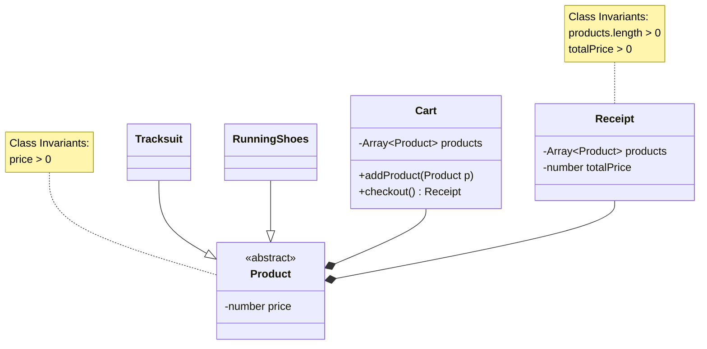

## Domain Model

> Changes:
> * replaced the `ProductType` enumeration with TrackSuit and RunningShoes classes
> * turned Product into an abstract class
> * replaced aggregation between Cart-Product and 
>   Receipt-Product to composition due to implementation

