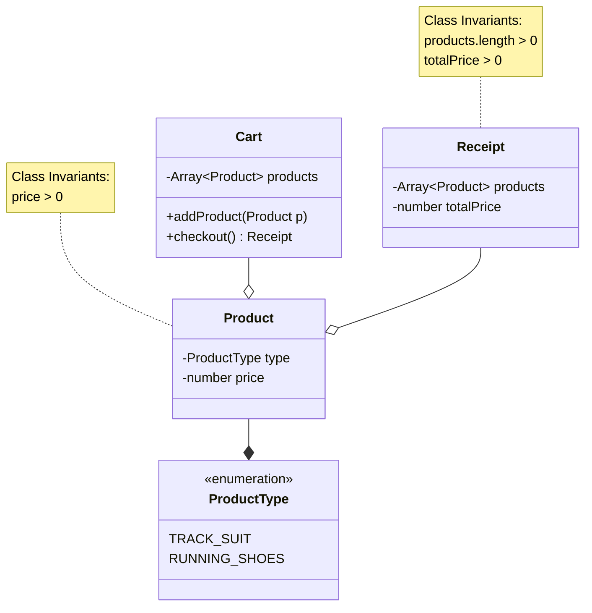

## Domain Model

```mermaid
classDiagram
    class Product {
        -ProductType type
        -number price
    }

    note for Product "Class Invariants:
        price > 0
    "

    Product --* ProductType

    class ProductType {
        <<enumeration>>
        TRACK_SUIT
        RUNNING_SHOES
    }

    class Cart {
        -Array~Product~ products

        +addProduct(Product p)
        +checkout() Receipt
    }

    Cart --o Product

    class Receipt {
        -Array~Product~ products
        -number totalPrice
    }

    Receipt --o Product    

    note for Receipt "Class Invariants:
        products.length > 0
        totalPrice > 0
    "
```

