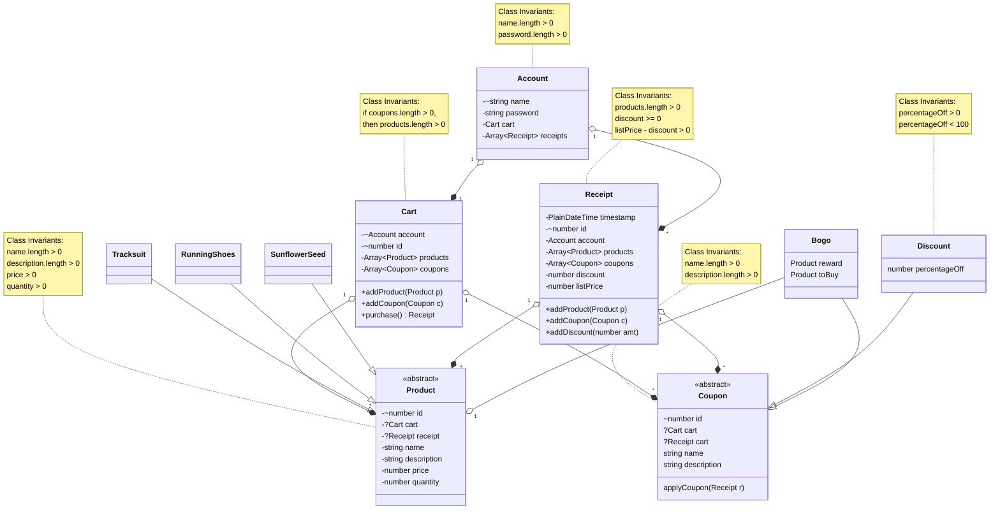

## Domain Model

#### Changes
1. Account 
   - renamed `checkout()` method to `purchase()`
   - note that password is stored only in the database. However, Account checks for it to be of non-zero length

2. Receipt
   - added coupons to Receipt

3. Discount
   - renamed `amountOff` property to `percentageOff`. Added a new invariant appropriately

```mermaid
classDiagram
class Account {
    -~string name
    -string password
    -Cart cart
    -Array~Receipt~ receipts
}

Account "1" o--* "1" Cart
Account "1" o--* "*" Receipt

note for Account"Class Invariants:
    name.length > 0
    password.length > 0
"

class Cart {
    -~Account account
    -~number id
    -Array~Product~ products
    -Array~Coupon~ coupons
    
    +addProduct(Product p)
    +addCoupon(Coupon c)
    +purchase() Receipt
}

Cart "1" o--* "*" Product
Cart "1" o--* "*" Coupon

note for Cart "Class Invariants:
    if coupons.length > 0,<br> then products.length > 0
"

class Product {
    <<abstract>>
    
    -~number id
    -?Cart cart
    -?Receipt receipt
    -string name
    -string description
    -number price
    -number quantity
}

note for Product "Class Invariants:
    name.length > 0
    description.length > 0
    price > 0
    quantity > 0
"

class Tracksuit { }

Tracksuit --|> Product

class RunningShoes { }

RunningShoes --|> Product

class SunflowerSeed { }

SunflowerSeed --|> Product

class Receipt {
    -PlainDateTime timestamp
    -~number id
    -Account account
    -Array~Product~ products
    -Array~Coupon~ coupons
    -number discount
    -number listPrice
    
    +addProduct(Product p)
    +addCoupon(Coupon c)
    +addDiscount(number amt)
}

Receipt "1" o--* "+" Product
Receipt "1" o--* "*" Coupon

note for Receipt "Class Invariants:
    products.length > 0
    discount >= 0
    listPrice - discount > 0
"

class Coupon {
    <<abstract>>
    
    ~number id
    ?Cart cart
    ?Receipt cart
    string name
    string description
    
    applyCoupon(Receipt r)
}

note for Coupon"Class Invariants:
    name.length > 0
    description.length > 0
"

class Discount {
    number percentageOff
}

note for Discount"Class Invariants:
    percentageOff > 0
    percentageOff < 100
"

Discount --|> Coupon

class Bogo {
    Product reward
    Product toBuy
}

Bogo --|> Coupon
Bogo --o "1" Product
```

