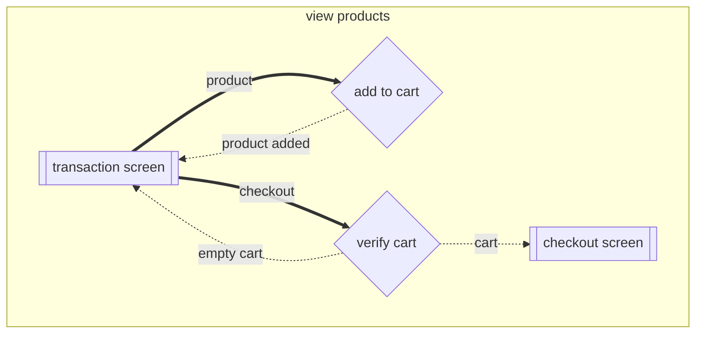
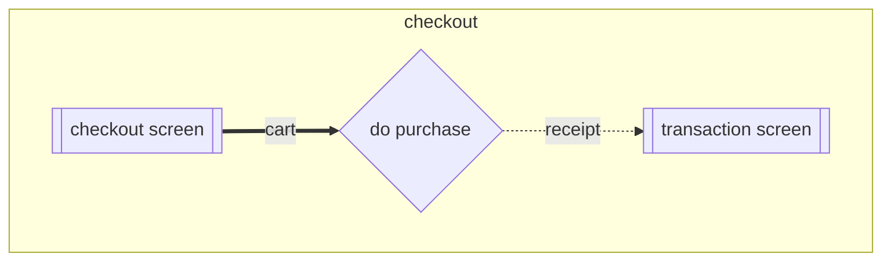

## Flows of Interaction

### View products

This is the first interaction screen displayed when the application starts.

```mermaid
flowchart TB
subgraph view products
    transaction_screen[[transaction screen]]
    add_to_cart{add to cart}
    verify_cart{verify cart}
    checkout_screen[[checkout screen]]

    transaction_screen == product ==> add_to_cart
    transaction_screen == checkout ==> verify_cart

    add_to_cart -. product added .-> transaction_screen

    verify_cart -. empty cart .-> transaction_screen
    
    verify_cart -. cart .-> checkout_screen
end
```

### Check out

```mermaid
flowchart TD
subgraph checkout
    checkout_screen[[checkout screen]]
    do_purchase{do purchase}
    transaction_screen[[transaction screen]]

    checkout_screen == cart ==> do_purchase

    do_purchase -. receipt .-> transaction_screen
end
```

