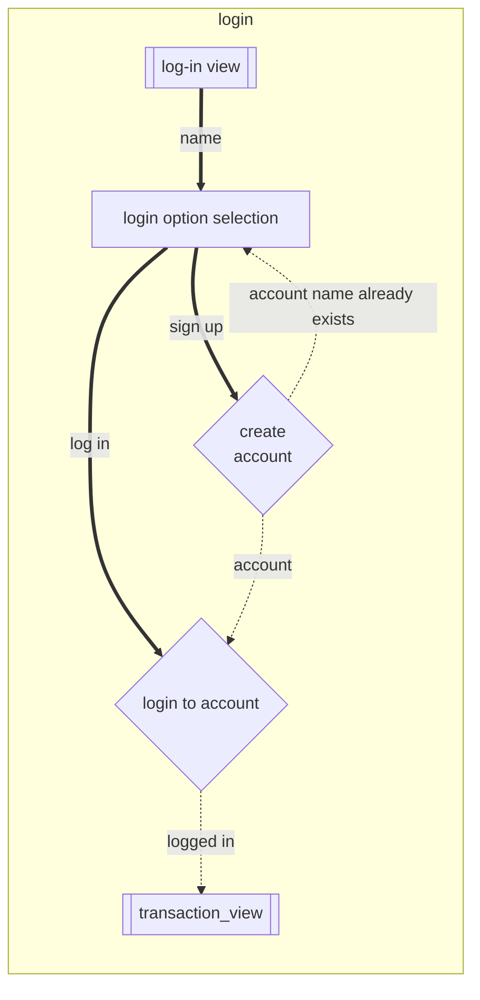
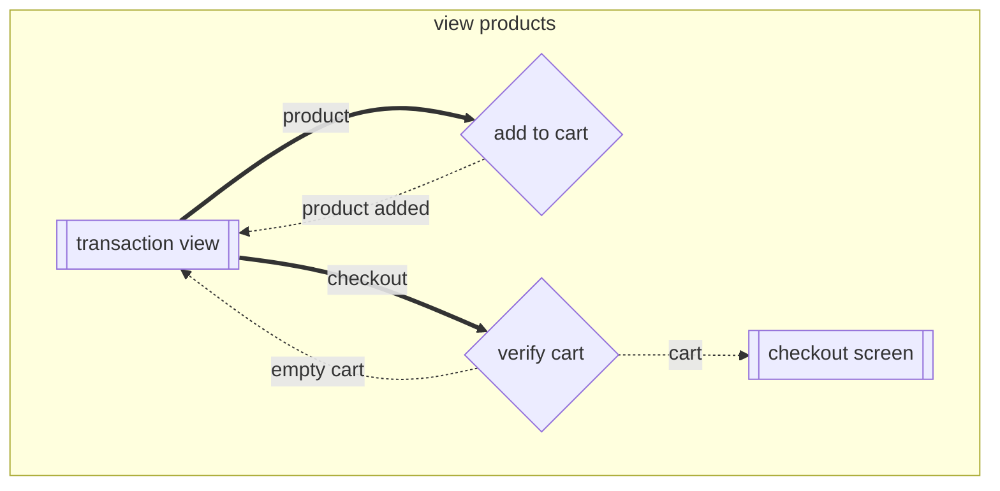
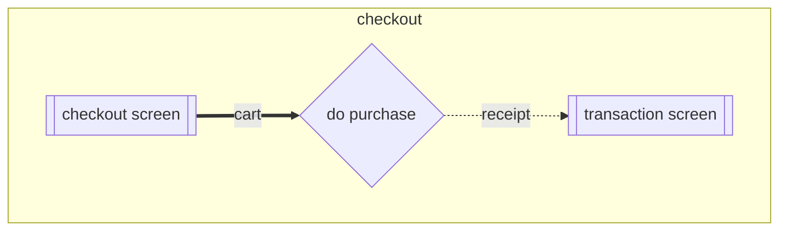

## Flows of Interaction

### Create account

This is the first interaction screen displayed when the application starts.

```mermaid
flowchart LR
    subgraph login 
    login_view[[log-in view]]
    login_option_selection[login option selection]
    create_account{create <br> account}
    login_to_account{login to account}
    transaction_view[[transaction_view]]

    login_view == name ==> login_option_selection

    login_option_selection == sign up ==> create_account
    login_option_selection == log in ==> login_to_account

    create_account -. account name already exists .-> login_option_selection
    create_account -. account .-> login_to_account

    login_to_account -. logged in .-> transaction_view
end
```

### View products

```mermaid
flowchart TB
subgraph view products
    transaction_view[[transaction view]]
    add_to_cart{add to cart}
    verify_cart{verify cart}
    checkout_screen[[checkout screen]]

    transaction_view == product ==> add_to_cart
    transaction_view == checkout ==> verify_cart

    add_to_cart -. product added .-> transaction_view

    verify_cart -. empty cart .-> transaction_view
    
    verify_cart -. cart .-> checkout_screen
end
```

### Check out

```mermaid
flowchart TD
subgraph checkout
    checkout_screen[[checkout screen]]
    do_purchase{do purchase}
    transaction_screen[[transaction screen]]

    checkout_screen == cart ==> do_purchase

    do_purchase -. receipt .-> transaction_screen
end
```

