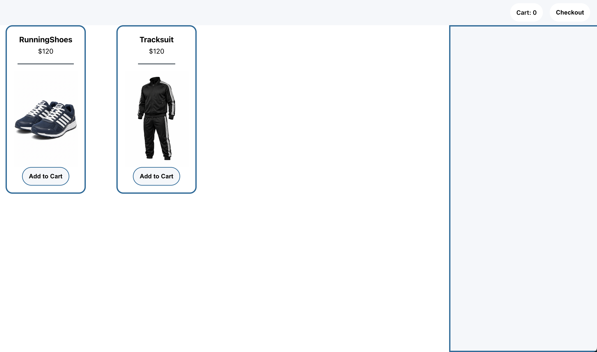
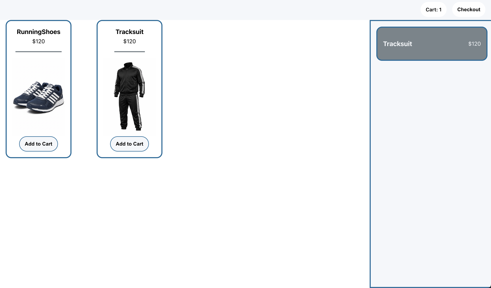
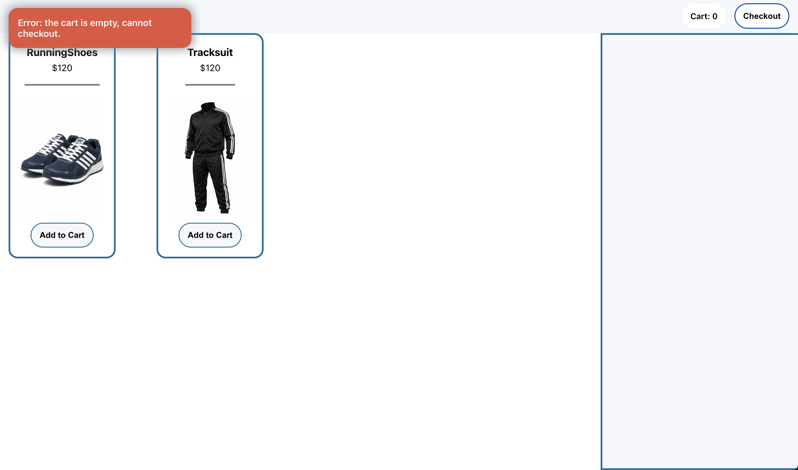
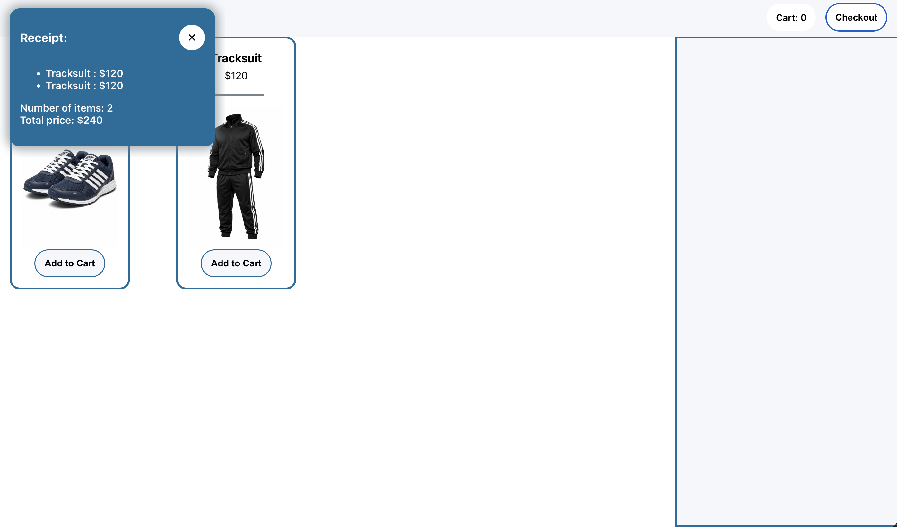
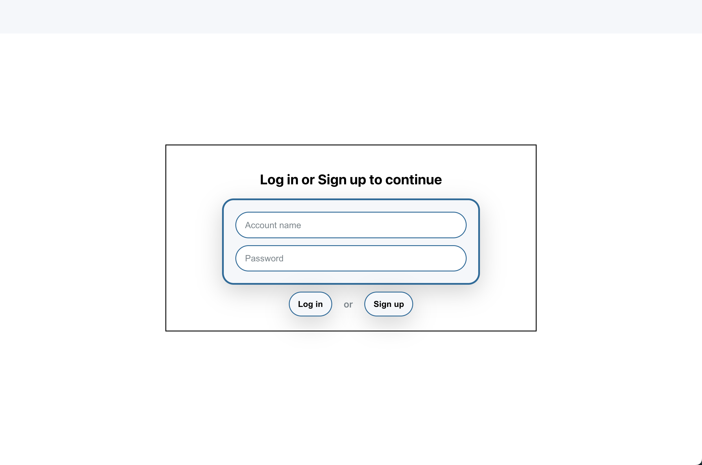
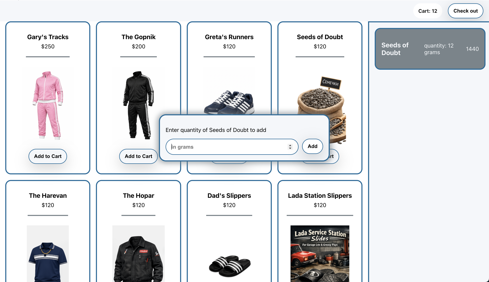
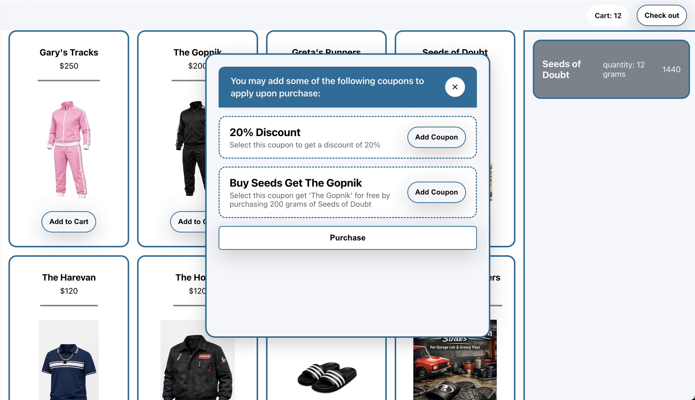
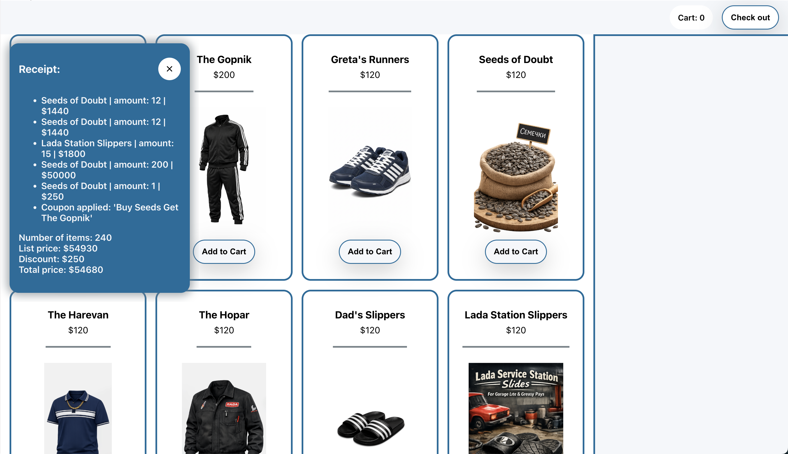
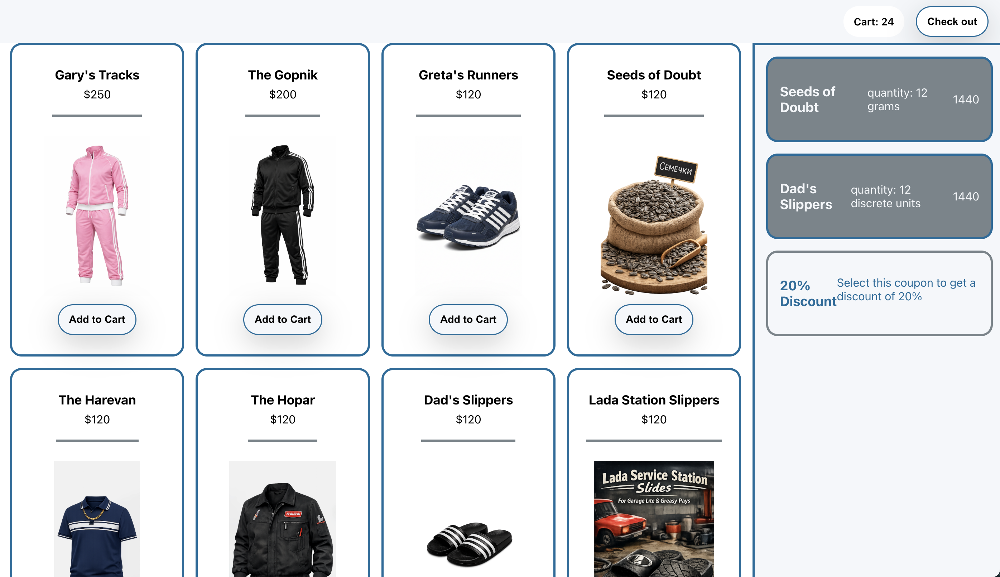

title: An assessment of the Point-of-Sale UI  
author: Narek Veranyan (veranyan@myumanitoba.ca)  
date: Winter 2026
---

---

# Phase 1

Here's my entire UI for phase 1:

## Phase 1 visibility

My initial implementation of this UI was fairly visible because:

* :+1: All the actions that the user can do are immediately shown on the screen.
  The user may either add a product to a cart, or -- after adding some -- checkout with the
  items selected.

## Phase 1 feedback

My initial implementation of this UI had adequate feedback:

* :+1: clicking the "Add to Cart" button shows as a response to the user that the item was successfully added
  to the cart -- it displays the item information in a box to the right side of the screen, the cart panel, and
  it updates the counter for the number of items in the cart, shown in the cart badge.

* :+1: when the user attempts to check out with an empty cart, the UI clearly indicates with a red notification badge
  to the top-left side of the screen that a checkout cannot be made with an empty cart. The red colour scheme of
  the notification as opposed to the rest of the system clearly indicates, together with the actual message of the
  notification, that it is a negative feedback about something that went wrong.

* :-1: however, the negative feedback about an empty-cart checkout can be made clearer by
  also asking the user to add products to the cart to fill it in for more informative feedback.

  
* :+1: when the user checks out with a non-empty cart, the checkout succeeds, and a receipt notification is shown in the
  top-left corner of the screen as feedback.

## Phase 1 consistency

My initial implementation of this UI had average consistency:

* :+1: all the buttons have labels
  
* :-1: but not all labels are verbs: the label for the button to check out is the noun "checkout" rather than the verb "check out."

* :+1: all buttons consistently do not have icons 

---

---

# Phase 2

Here are the major new parts of my interface for phase 2:

#### 1 - the login/signup screen is the first thing shown in the system now

#### 2 - the dialog for entering the quantity of that product to add to cart

#### 3 - the coupon selection for choosing coupon to apply to receipt upon purchase

#### 4 - the new notification for the receipt, including additional information

#### 5 - the main menu (transaction screen) UI submitted for phase 2:

## Changes from phase 1

* The main change made from phase 1 to phase 2 was that now the user has to log in or
  sign up to the system first, before getting to browsing the catalogue and purchasing products.

* The user is now prompted to enter a quantity of the selected product to be added to the cart

* The user is now offered an option to select coupons to apply to the receipt upon purchase, so
  clicking on "checkout" button does not immediately proceed to purchasing the items.

## Phase 2 visibility

The visibility for phase 2 is good.

* :+1: In the context of login/signup screen, the system is very visible: the input fields and buttons
  to interact with the system are displayed in the centre. It clearly shows what state the user is
  in the process of interacting with the system -- it is the login stage only after which they may use the system. Also, the cursor is auto-focused on one of the input
  fields, making it clear that the user can enter text in that field.

* :+1: The dialog for product amount is clearly visible. It is shown in the centre of the screen, with
  the cursor auto-focusing on the input field and giving a description of what the prompt is,
  making it clear to the user what stage they are at -- describing how much of the selected item they want to add.

* :+1: The selection screen for the coupons is visible since it is displayed in the centre of the UI, with
  buttons visible next to the corresponding coupon to add to the cart. The prompt above informs the user
  that they can skip adding coupons, and the user clearly knows that they are at the final step of making
  a purchase.

* :-1: However, since logging in to the system can take a long time, the login and signup buttons are disabled
  at the moment. But it is not shown in the UI that the button is disabled.

## Phase 2 feedback

* :-1: Creating accounts takes noticeable amount of time, but the system does not communicate to the user that
  it is currently doing processing.

* :+1: Unsuccessful login or signup is notified to the user with an error notification. The error notification
  has a message reflecting the reason of the problem -- empty name or password, incorrect password, etc. The user
  clearly knows what went wrong and how to fix it.

* :+1: Success in adding coupons to the cart is communicated to the user -- the system immediately displays the new
  coupon in the cart panel, as well as removing the same coupon from further selection.

  
* All the other UI elements remained the same in terms of feedback since phase 1. 

## Phase 2 consistency

* :+1: All the buttons are styled the same way, with verbs used for each as a label. None of the buttons has an icon, 
  which makes them consistent.

* :+1: The purchase button is styled slightly differently to emphasise its significance (it is the last step in the process),
  but other than the style, it is consistent with the rest.

## How I might change my UI

* I would add a message with a loading spinner to the screen when the user attempts to log in or create a new account so
  that the user knows that the system is performing a long-running task but is functioning correctly. 

